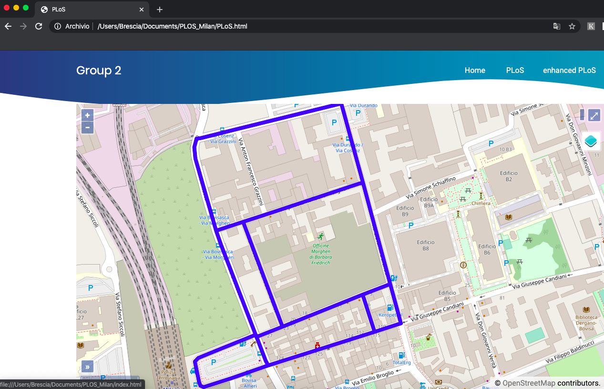

 
   
#  :arrow_right: Enhanced Pedestrian Level of Service (PLoS): :arrow_left:
Data Collection, Processing and Visualization of the result of Plos computation of an area in Milan (Milano Nord Bovisa Station). 

## What is PloS?
The Pedestrian LOS Model is aimed at evaluating walking conditions on road and street corridors in urban environment.
PLoS is a measure of comfort and safety of existing and planned walkways. It allows objective and sound evaluations of pedestrians’ perception and response to roadway environment.

## Project 
Web GIS about a QGIS project of PLOS computation of an area in Milan (Milano Nord Bovisa Station)

<kbd></kbd><kbd></kbd>

 
 

### Implementation: Steps

1- **Collect Data**: Using [EpiCollect](https://five.epicollect.net) our group collects measurament of data for PLoS computation. Then we store the results in a field survey and download them in .csv format;
 
 
 
 
 
 
 
 
2- **Data Processing**: we process data using QGIS, with operations such as buffer, intersection and attribute table manipulation in order to associate each point value to the corresponding road network and to compute the PLoSs index for each segments;
 
 
 
 
 
 
 

3- **WebGIS develop**: we develop a [website](https://github.com/bresc19/PLOS_Milan/blob/master/index.html) in order to show the the result of the PLoSs index computation
 
 
 
 
 
 

## Website Implementation :computer:
- **LayerSwitcher** in order to change basemaps;
- **WFS** (points) and **WMS** connections;
- **GetFeatureInfo** request for WMS layer;
- **Popup** in order to show PLoS computation;

### Tool Used :wrench:
- 
- 
- 
- 

### Authors :bust_in_silhouette: :bust_in_silhouette: :bust_in_silhouette: :bust_in_silhouette:

* **Bresciani Matteo** 
* **Orsenigo Andrea**
* **Gabriele D’Ascoli**
* **Metehan Ergen**
